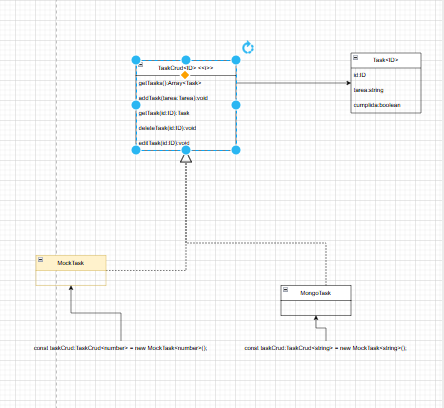

GET /tasks → devuelve todas las tareas.

POST /tasks → crea una nueva tarea.

GET /tasks/:id → devuelve una tarea por id.

PUT /tasks/:id → actualiza una tarea.

DELETE /tasks/:id → elimina una tarea.
# Grafico uml

